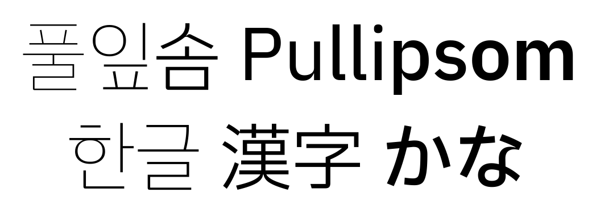
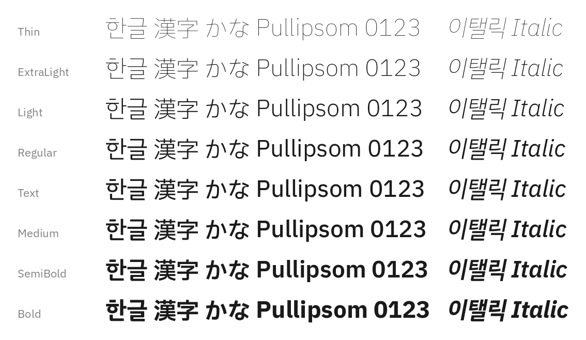
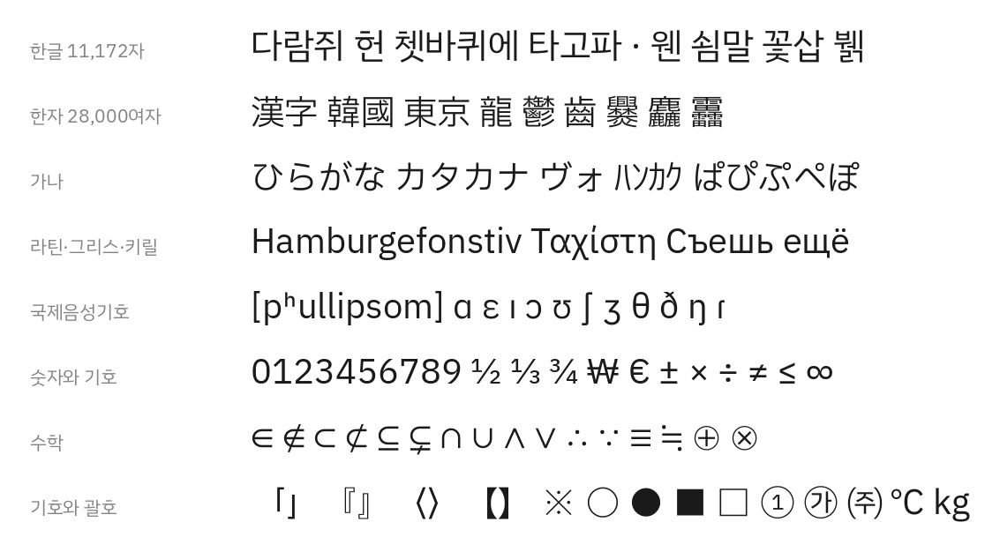

# 풀잎솜 (Pullipsom)

IBM Plex Sans KR에 한글과 한자, 가나를 합쳐서 만든 CJK 가변폭 글꼴입니다.

| | |
|---|---|
| **담은 글자** | 라틴·그리스·키릴, 한글 11,172자, 한자 30,000여 자, 가나 |
| **굵기** | Thin부터 Bold까지 여덟 굵기, 각각 이탤릭 |

고정폭이 필요하면 [Monoplex](https://github.com/y-kim/monoplex)를 쓰세요. IBM Plex Mono에서 태어난 터미널과 편집기를 위한 프로그래밍 글꼴입니다.

# 소스 글꼴

같은 코드포인트를 여러 글꼴이 갖고 있을 때는 아래 순서로 먼저 있는 것을 씁니다.

```
IBM Plex Sans    →  Plex Sans KR     →  Plex Sans JP  →  Plex Sans TC  →  Plex Sans SC
라틴·그리스·키릴    한글·한국어 기호    가나·한자        한자 보충        간체·확장A
```

# 레시피

IBM Plex Sans KR은 전통적인 CJK 메트릭을 버리고, IBM Plex Sans의 로마자에 한글을 배치를 맞춘 글꼴입니다.
다만 CJK 메트릭을 버리지 못한 한자와 가나는 IBM Plex Sans KR에 포함되지 못하였습니다.
여기에서는 CJK 메트릭을 사용한 한자와 가나가, IBM Plex Sans KR의 한글에 어울리도록, 크기와 베이스를 조절한 뒤
하나의 그릇으로 모읍니다. 어떻게 해서 만들었는지 [RECIPE.md](RECIPE.md)를 읽어보세요.

# 갤러리

**한글과 한자, 가나를 섞어서** — 한자와 가나는 이탤릭에서도 곧게 섭니다.


**여덟 굵기와 이탤릭**



**담은 글자**



# 설치

릴리즈 페이지에서 글꼴을 받아주세요: https://github.com/y-kim/pullipsom/releases

압축 파일을 풀면 ttf 파일이 생깁니다. 각 운영체제에서 제공하는 방법으로
설치할 수 있습니다.

# 직접 빌드하기

빌드 도구는 [hapchija](https://github.com/y-kim/hapchija) 저장소에 있고 `tools/`
서브모듈로 들어옵니다. 소스 글꼴은 용량이 커서 저장소에 넣지 않고 받아 옵니다.

```bash
git clone --recursive https://github.com/y-kim/pullipsom
cd pullipsom

# 소스 글꼴 받기 (170MB)
PYTHONPATH=tools/src python3 -m hapchija fetch --recipe recipes/pullipsom.json

docker run --rm -v "$(pwd):/work" ghcr.io/yuru7/composite-font-builder \
  bash -c "cd /work && PYTHONPATH=tools/src python3 -m hapchija build --recipe recipes/pullipsom.json"
```

| 문서 | 내용 |
|---|---|
| [HOW_TO_BUILD.md](HOW_TO_BUILD.md) | 빌드하는 법 |
| [RECIPE.md](RECIPE.md) | 레시피가 무엇을 왜 그렇게 하는지 |
| [VERSIONING.md](VERSIONING.md) | 버전을 매기는 기준 |
| [CHANGELOG.md](CHANGELOG.md) | 변경 이력 |

# 사용한 소스 글꼴

내부 버전은 글꼴 파일 안에 적힌 값으로, 배포 패키지의 번호와 다를 수 있습니다.

| 글꼴 | 내부 버전 | 업스트림 릴리스 | 쓰는 곳 |
|---|---|---|---|
| IBM Plex Sans | 3.005 | [`@ibm/plex-sans@1.1.0`](https://github.com/IBM/plex/releases/tag/%40ibm%2Fplex-sans%401.1.0) | 라틴·그리스·키릴, 이탤릭 |
| IBM Plex Sans KR | 1.002 | [`v6.4.2`](https://github.com/IBM/plex/releases/tag/v6.4.2) (마지막 통합 릴리스) | 한글, 한국어 기호 |
| IBM Plex Sans JP | 1.004 | [`@ibm/plex-sans-jp@3.0.0`](https://github.com/IBM/plex/releases/tag/%40ibm%2Fplex-sans-jp%403.0.0) | 가나, 한자, 국제음성기호 |
| IBM Plex Sans TC | 1.001 | [`@ibm/plex-sans-tc@1.1.1`](https://github.com/IBM/plex/releases/tag/%40ibm%2Fplex-sans-tc%401.1.1) | 한자 보충 |
| IBM Plex Sans SC | 1.000 | [`@ibm/plex-sans-sc@1.1.0`](https://github.com/IBM/plex/releases/tag/%40ibm%2Fplex-sans-sc%401.1.0) | 간체·확장A |

IBM Plex Sans KR 최신 버전인 1.003에서 반각 한글 자모가 빠져 이번 버전인
1.002를 사용합니다.

# 알려진 이슈

## 전각이 두 가지입니다

한자와 가나는 960, IBM Plex Sans KR이 전각으로 그린 기호·구두점·전각 라틴·괘선은
1000입니다. 한 줄에 섞이면 칸이 4% 어긋납니다.

셋을 하나로 모으려면 어느 한쪽을 옮겨야 하는데, 1000 쪽을 960으로 줄이면 괄호가
한글보다 낮게 앉고 괘선이 세로로 이어지지 않습니다. 960 쪽을 1000으로 되돌리면
한자 좌우 여백이 50씩으로 넓어집니다. 지금은 세 체계를 그대로 두고 있습니다.

■ ○ ★ ① ㈜ 같은 기호는 CJK 소스에만 있어서 전각 그대로 들어옵니다. 비례폭
자형이 어느 소스에도 없어 줄이면 자형을 새로 만드는 일이 됩니다.

같은 이유로 음악 기호는 ♩ ♪ ♭가 비례폭, ♫ ♬ ♮ ♯이 전각입니다. 기타 기술
블록(⌘ ⎛ ⏎)에도 두 폭이 섞여 있습니다.

## 옛한글을 조합할 수 없습니다

첫가끝 자모(U+1100–11FF)가 없습니다. IBM Plex Sans KR에 없어서 그렇습니다.
현대 한글 11,172자는 모두 들어 있습니다.

## Thin 굵기에만 57자가 없습니다

IBM Plex Sans KR 1.002의 Thin에 반각 한글 자모 51자를 비롯한 57자가 빠져
있습니다. 나머지 일곱 굵기에는 다 있습니다.
